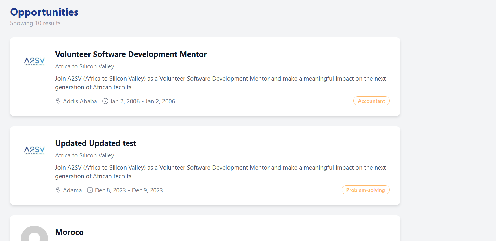

# Job Opportunities Platform

A modern Job Opportunities web application built with **React**, **TypeScript**, **Vite**, and **Tailwind CSS**. This application allows users to browse and view job opportunities with detailed information.

## Features

- Browse job opportunities with detailed cards
- View comprehensive job details including responsibilities, requirements, and company information
- Responsive design that works on all devices
- Clean, modern UI built with Tailwind CSS
- Real-time data fetching from a RESTful API
- Comprehensive error handling and loading states
- Intuitive navigation between job listings and details

### Job Card Page



### Job Dashboard Page


### pagr loading


### Error


## Project Structure

```
job-opportunities-app/
├── public/
│   └── avatar.jpg           # Default avatar image
├── src/
│   ├── App.tsx              # Main app component with data fetching logic
│   ├── App.css              # Tailwind CSS directives
│   ├── main.tsx             # Entry point
│   ├── components/
│   │   ├── JobCard.tsx      # Job card component
│   │   └── JobDashboard.tsx # Job details component
│   └── services/
│       └── api.ts           # API service for fetching job data
```

## API Integration

This application fetches job listings from a RESTful API. The API service includes the following features:

- Type-safe API responses with TypeScript interfaces
- Centralized error handling
- Clean separation of concerns

### API Endpoints

- `GET /opportunities/search` - Retrieve a list of job opportunities
- `GET /opportunities/:id` - Get details for a specific job opportunity

### API Base URL

```
https://akil-backend.onrender.com/
```

## Getting Started

### 1. Install dependencies

```sh
npm install
```

### 2. Start the development server

```sh
npm run dev
```

### 3. Build for production

```sh
npm run build
```

## Error Handling

The application includes comprehensive error handling:

- Network errors are caught and displayed to the user
- API errors are properly formatted and shown
- Users can retry failed requests
- Error boundaries prevent the entire app from crashing

## Loading States

- Loading spinners are shown during data fetching
- Skeleton loaders provide better user experience
- Smooth transitions between states

## State Management

This application currently uses React's built-in state management with the Context API and hooks:

- `useState` for local component state
- `useEffect` for side effects and data fetching
- Props for component communication
- Custom hooks for reusable logic

### Future Considerations: Redux

For larger applications or as the project scales, Redux could be integrated to:

- Centralize application state management
- Enable powerful devtools for state inspection
- Implement middleware for complex side effects
- Make state more predictable and easier to debug

To add Redux in the future, you would need to:

1. Install required packages: `@reduxjs/toolkit` and `react-redux`
2. Create a Redux store with slices for different features
3. Wrap your app with the Redux Provider
4. Use `useSelector` and `useDispatch` hooks in components

## Dependencies

- React 18
- TypeScript
- Vite
- Tailwind CSS
- React Icons
